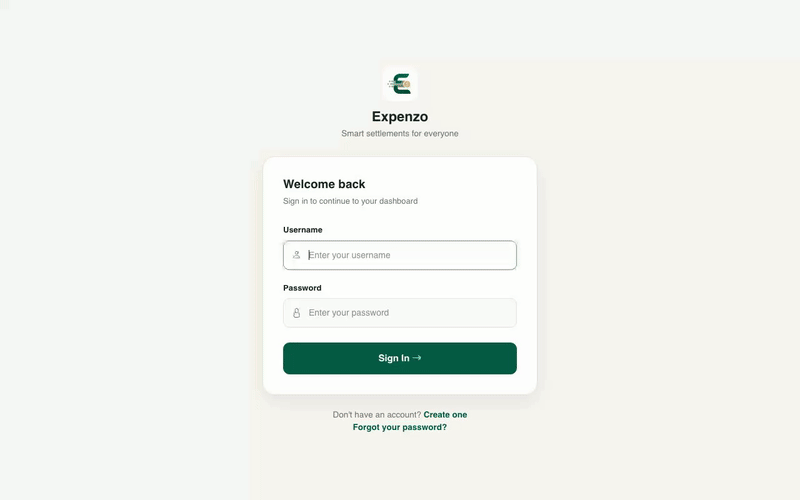
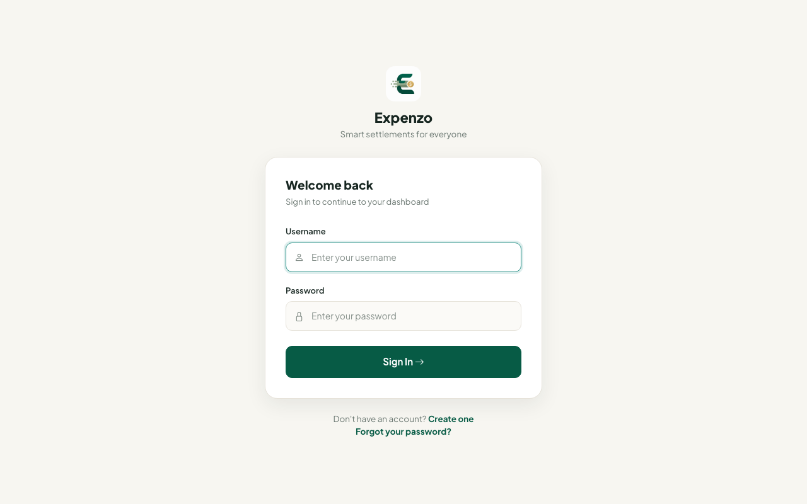
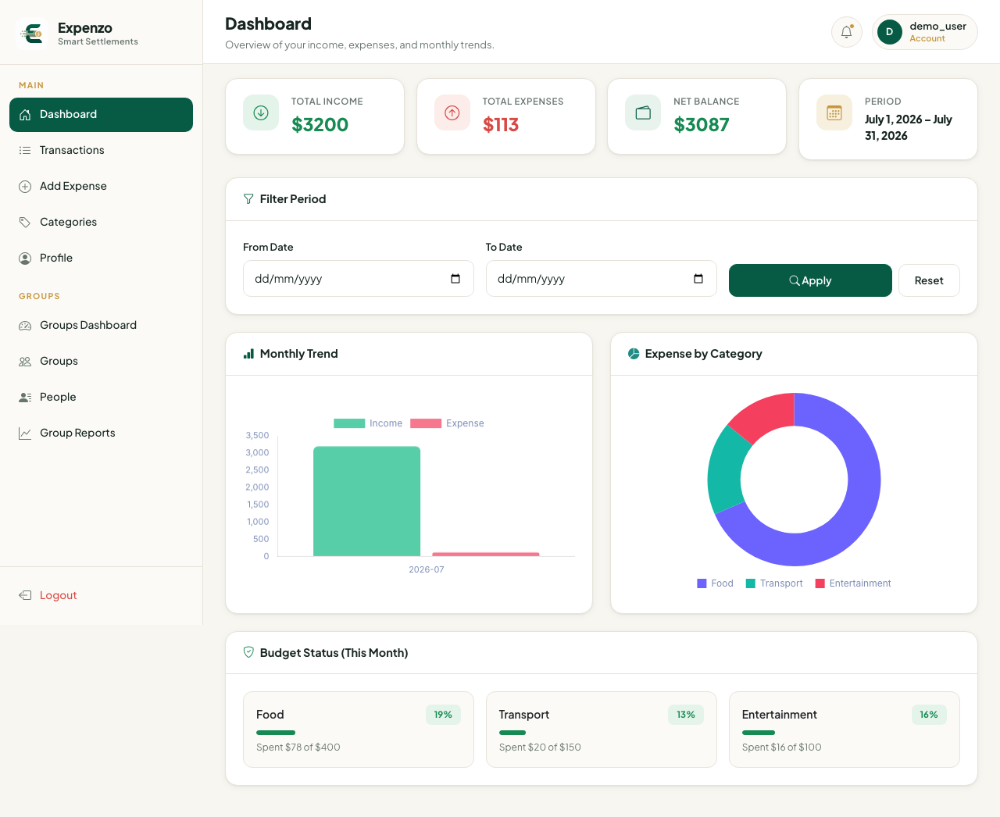
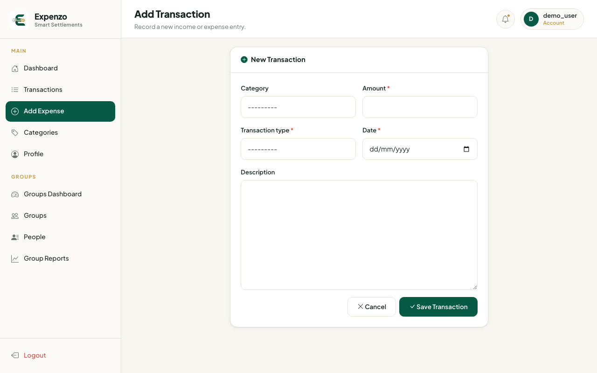
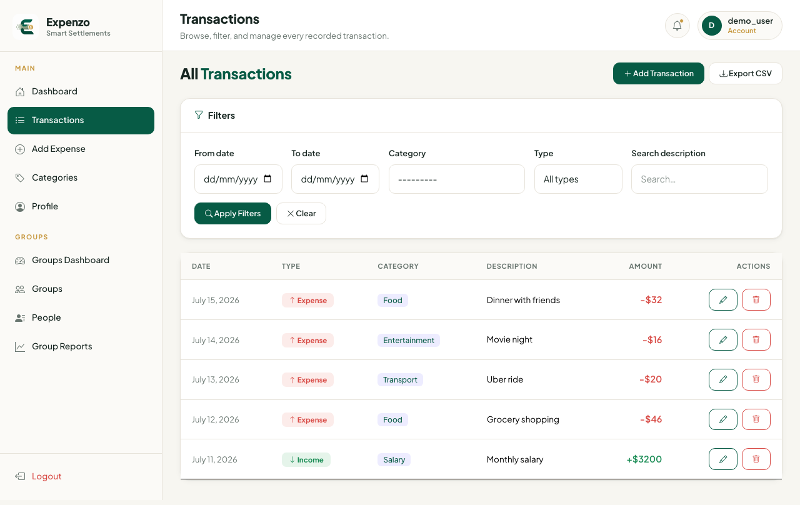

<div align="center">
  

  # Expenzo

  **Smart expense tracking and group settlements, built with Django.**

  
  
  
  

</div>

---

## See it in action

<div align="center">
  
</div>

A quick walkthrough: sign in → view the dashboard → add a transaction → see it reflected in the transaction list.

## Features

- **Transaction tracking** — log income and expenses with category, amount, date, and notes
- **Dashboard analytics** — monthly income/expense trends and expense-by-category charts at a glance
- **Category budgets** — set a monthly budget per category and track spend against it
- **Transaction management** — filter, search, edit, delete, and export transactions to CSV
- **Group expenses & smart settlements** — split shared expenses across a group of people and automatically compute who owes whom
- **People directory** — manage the people you regularly split expenses with, independent of user accounts
- **Multi-currency profile** — choose your preferred currency (USD, EUR, GBP, PKR, INR)
- **Authentication** — registration, login/logout, and password reset flows

## Screenshots

<table>
  <tr>
    <td align="center"><b>Login</b></td>
    <td align="center"><b>Dashboard</b></td>
  </tr>
  <tr>
    <td></td>
    <td></td>
  </tr>
  <tr>
    <td align="center"><b>Add Transaction</b></td>
    <td align="center"><b>Transaction List</b></td>
  </tr>
  <tr>
    <td></td>
    <td></td>
  </tr>
</table>

## Tech stack

- [Django 4.2](https://www.djangoproject.com/) — web framework
- [django-filter](https://django-filter.readthedocs.io/) — transaction filtering
- [django-widget-tweaks](https://github.com/jazzband/django-widget-tweaks) — form rendering
- [pytest](https://docs.pytest.org/) + [pytest-django](https://pytest-django.readthedocs.io/) — testing

## Getting started

```bash
# clone the repo
git clone https://github.com/muhammadali-dotcom/django-expense-tracker.git
cd django-expense-tracker

# create and activate a virtual environment
python -m venv venv
source venv/bin/activate      # on Windows: venv\Scripts\activate

# install dependencies
pip install -r requirements.txt

# apply migrations
cd expense_tracker
python manage.py migrate

# create an account to log in with
python manage.py createsuperuser

# run the dev server
python manage.py runserver
```

Then open `http://127.0.0.1:8000/` in your browser.

## Project structure

```
django-expense-tracker/
├── expense_tracker/
│   ├── expense_tracker/   # Django project settings & root URLs
│   ├── tracker/           # Main app: models, views, forms, templates
│   └── manage.py
├── screenshots/           # App screenshots + demo GIF
├── images/                # Logo assets
└── requirements.txt
```

## Running tests

```bash
cd expense_tracker
pytest
```
